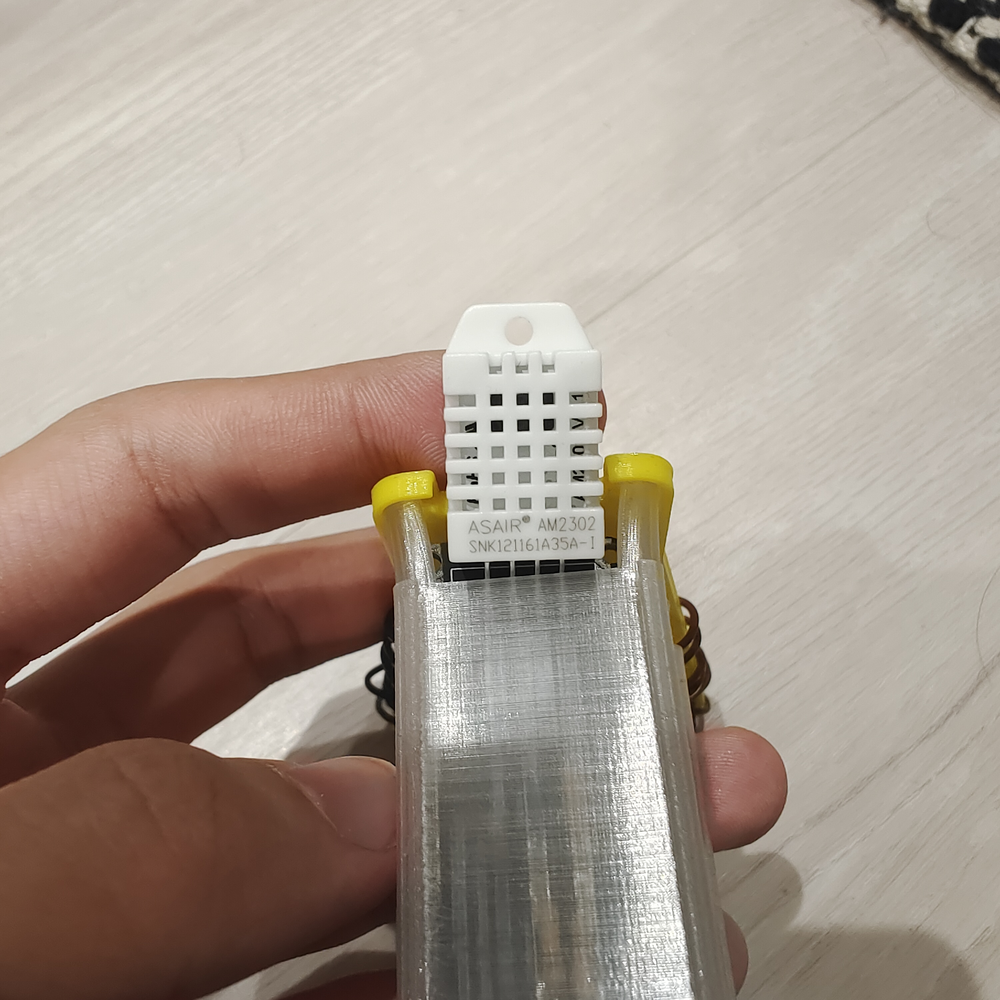
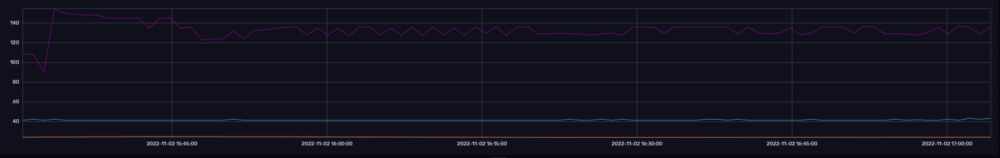
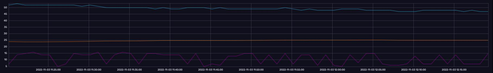
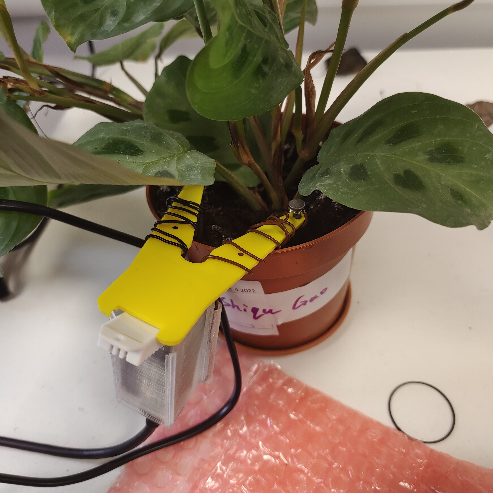

# PlantMonitor

The plant monitor is used to monitor the current health condition of the plant, hoping that the plant will stay healthy and active.
Through the collection of temperature, humidity and other data, these data will be sent to the specified topic through the mqtt protocol over time, users can subscribe to the topic to obtain the relevant data.
Data is also transferred to the Raspberry PI database, which can be visualized using tools such as influxdb or grafana to facilitate better data analysis.

# sensor used in this project
1. DHT22：Mainly used to obtain the humidity and temperature in the air

2.2 nails：Used to measure soil moisture

# how to send data through MQTT
Next, we will use the Adafruit Feather HUZZAH ESP8266 for WiFi connection and publish the obtained data to the MQTT server.
In this case, you need to use the ESP8266WIFI library to try to connect to wifi and get the time through the EZtime library. 
After these preconditions are completed, the PubSubClient library can be used to connect to the MQTT server more easily, publish the data to the specified topic, and obtain the data by subscribing to the topic.

#visualise data through raspberry pi
The final step in implementing the plant monitor is to use the raspberry PI as a data store. By downloading influxdb into the Raspberry PI, you can access the influxdb from your own device after entering instructions on the raspberry PI and restarting it. After installing the Raspberry PI template inside, you can create buckets to store data.The next step is to install telegraf in Raspberry PI to collect time series data. After the installation, edit the configuration file and transfer the file to the mqtt-data bucket with the given token. After restarting telegraf, data visualization can be realized

# Analyze the data
data after watering the plant

1 day after watering

This data is quite correct in other places, but when testing the soil moisture, it can be clearly seen here that the data of the second round of soil moisture fluctuates between 5 and 10. However, through discussion with my classmates, I found that the normal soil moisture fluctuates between 15 and 25, so I think I made mistakes in some places. 
So I first went back to check whether there was a mistake in the resistance welding on the PCB board. After verifying that it was correct, I thought there might be a phenomenon of virtual welding between the wire and the nail, so the distance between the two points was relatively larger.
So I welded the wires and nails again, and then I found that the data recovered to a reasonable range after the operation.
！[3rddata](./image/correct_data.png)

# Working plant monitor

# Extra function
I have placed two folders in the project directory, one of which is the plant monitor mentioned above, and the other is called SendEmail, because it is not always possible for a plant keeper to get immediate information when the soil moisture level is low, so I want to add a function to provide feedback to the user when the soil moisture level is low I would like to add a function to give feedback to the user when the soil is low. It just so happens that the hazzah we are using has a wifi module and can help us to send and receive emails. However, there are still two drawbacks, the first being that the original design used qq email, which is popular in China, making it more difficult to test. The second is that because it imports an unfamiliar library directly, it is not possible to set the interval between sending emails for the time being, so it will post an email within a few seconds, which can be annoying for users. So maybe in the future, when I can set this email interval, I will import the functions in this file into the plant monitor and set the value of moisture to detect when it is less than 15, so that the function can be used to alert users.
